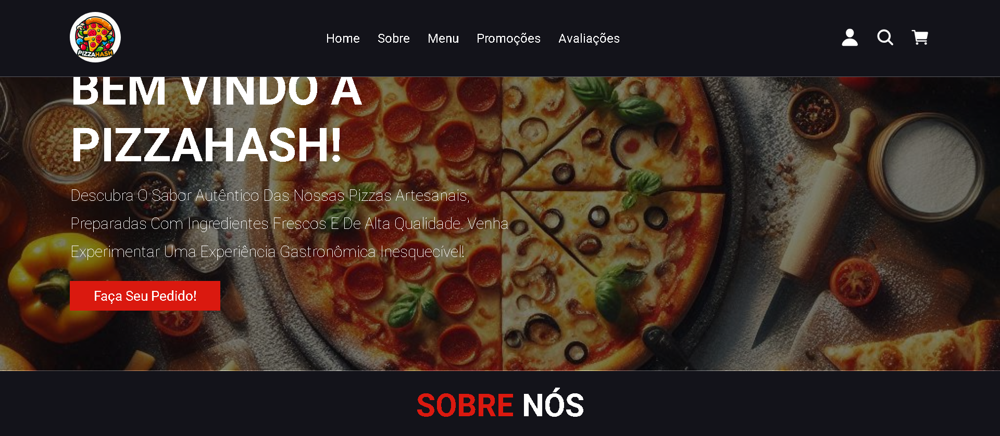

# 🍕 PizzaHash

Landing page responsiva para a pizzaria fictícia **PizzaHash**, desenvolvida em **HTML5** e **CSS3** com integração de ícones via [Ionicons](https://ionic.io/ionicons).  
O projeto é focado em apresentar o cardápio, promoções e avaliações de clientes de forma clara e atrativa.

---

## 📸 Demonstração

  

---

## 📂 Estrutura do Projeto

```

📦 PizzaHash
├── 📂 assets
│ ├── 📂 images # Imagens usadas no site
│ └── style.css # Folha de estilos principal
├── index.html # Página principal
└── README.md # Este arquivo

```

---

## 🚀 Tecnologias Utilizadas

- **HTML5** – Estrutura do conteúdo
- **CSS3** – Estilização e responsividade
- **Ionicons** – Ícones para navegação e botões

---

## 🎯 Funcionalidades

- **Seções**:
  - Home (apresentação)
  - Sobre nós
  - Menu
  - Combos e promoções
  - Avaliações de clientes
  - Rodapé com links úteis e redes sociais
- **Design responsivo** para diferentes tamanhos de tela.
- **Ícones interativos** com Ionicons.
- Estrutura de código organizada e comentada.

---

## 🔧 Personalização

- Substitua as imagens da pasta `assets/images` pelas imagens reais da sua pizzaria.
- Ajuste os textos das seções diretamente no `index.html`.
- Edite as cores, fontes e espaçamentos no `assets/style.css`.

---

## 📜 Licença

Este projeto é de uso livre para fins de estudo e portfólio.
Você pode modificá-lo e adaptá-lo, mas mantenha os créditos originais.
